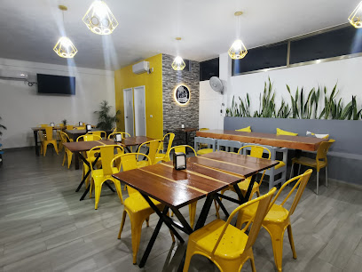

# 🎉 Nuevas Funcionalidades - Administración de Menús, Galería y Configuración

## 📋 Resumen de Cambios

Se han agregado tres nuevas secciones al panel de administración para control total de la página principal:

1. **Gestión de Menús** - Administrar menús en imagen o PDF
2. **Gestión de Galería** - Subir y administrar imágenes
3. **Configuración de Tienda** - Cambiar logo e imagen principal

## 🏠 Página Principal Actualizada

La página principal ahora incluye:
- ✅ Sección de **Menús** - Muestra menús del restaurante
- ✅ Sección de **Galería** - Exhibe imágenes del lugar
- ✅ Logo dinámico - Se carga desde Firestore
- ✅ Imagen principal dinámico - Se actualiza desde admin

## 📱 En la Página Principal

Los usuarios verán:
1. **Navbar** - Logo (dinámico) + Links a todas secciones
2. **Hero** - Imagen principal (dinámico)
3. **Menús** - Sección con menús subidos desde admin
4. **Galería** - Sección con imágenes de la tienda
5. **Productos** - Como antes
6. **Sobre Nosotros** - Como antes
7. **Contacto** - Como antes

## 🔧 Panel de Administración - Nuevas Secciones

### 1️⃣ MENÚS

#### ➕ Agregar Menú
1. Menú lateral → **"Menús"**
2. Haz clic en **"+ Agregar Menú"**
3. Completa:
   - **Nombre**: Ej: "Menú Desayunos"
   - **Tipo**: 
     - `Imagen` - Sube foto del menú
     - `PDF` - Proporciona enlace al PDF
4. Haz clic en **"Guardar Menú"**

#### 📋 Editar/Eliminar Menú
- Los menús aparecen en tarjetas
- Haz clic en **"Eliminar"** para quitar un menú

**Colecciones en Firestore:**
```
menus/
├── id1: { nombre, tipo, imagen, enlace, creado }
├── id2: { nombre, tipo, imagen, enlace, creado }
```

### 2️⃣ GALERÍA

#### ➕ Agregar Imagen
1. Menú lateral → **"Galería"**
2. Haz clic en **"+ Agregar Imagen"**
3. Completa:
   - **Título**: Opcional (Ej: "Tienda principal")
   - **Imagen**: Sube la foto
4. Haz clic en **"Subir Imagen"**

#### 🗑️ Eliminar Imagen
- Las imágenes aparecen en grid
- Haz clic en botón **"Eliminar"** en la esquina superior derecha

**Colecciones en Firestore:**
```
galeria/
├── id1: { titulo, url, creado }
├── id2: { titulo, url, creado }
```

### 3️⃣ CONFIGURACIÓN

#### 🎯 Logo de la Tienda
1. Menú lateral → **"Configuración"**
2. Sección: **"Logo de la Tienda"**
3. Opciones:
   - **Cambiar Logo**: Sube nueva imagen
   - **Eliminar Logo**: Quita el logo actual

#### 🖼️ Imagen Principal (Hero)
1. Menú lateral → **"Configuración"**
2. Sección: **"Imagen Principal (Hero)"**
3. Opciones:
   - **Cambiar Imagen**: Sube nueva imagen
   - **Eliminar Imagen**: Quita la imagen actual

**Colecciones en Firestore:**
```
configuracion/
├── tienda: { logo, imagenPrincipal }
```

## 🗄️ Estructura Firestore

Nuevas colecciones creadas automáticamente:

```
carolasgreen (proyecto)
├── productos/ (existente)
├── pedidos/ (existente)
├── comentarios/ (existente)
├── menus/
│   └── {documentId}: {
│       nombre: string,
│       tipo: "imagen" | "pdf",
│       imagen: string (URL),  // Si tipo es imagen
│       enlace: string (URL),  // Si tipo es pdf
│       creado: timestamp
│   }
├── galeria/
│   └── {documentId}: {
│       titulo: string,
│       url: string (imagen subida a Storage),
│       creado: timestamp
│   }
└── configuracion/
    └── tienda: {
        logo: string (URL),
        imagenPrincipal: string (URL)
    }
```

## 💾 Almacenamiento en Firebase Storage

Los archivos se guardan en:
```
/storage/buckets/carolasgreen.appspot.com/
├── menus/
│   ├── {timestamp}_{nombre}.jpg
│   └── {timestamp}_{nombre}.png
├── galeria/
│   ├── {timestamp}_{nombre}.jpg
│   └── {timestamp}_{nombre}.png
└── configuracion/
    ├── logo_{timestamp}
    └── imagen_principal_{timestamp}
```

## 🎨 Cambios en la Página Principal

### Antes
```html


```

### Ahora
```html
 <!-- Dinámico -->
 <!-- Dinámico -->
```

Se cargan automáticamente desde `configuracion/tienda` en Firestore.

## 🌐 Flujo de Datos

```
Admin Panel
  ↓
Firebase (Firestore + Storage)
  ↓
Página Principal (carga automáticamente)
```

## 📝 Notas Importantes

1. **Las imágenes dinámicas reemplazan las rutas fijas:**
   - Logo ya no está en `/LOGO/logo.jpg`
   - Imagen principal ya no está en `/IMAGENESDELATIENDA/1.jpg`

2. **Las imágenes se suben a Cloud Storage:**
   - Más seguro
   - URLs públicas y durables
   - Fácil de cambiar sin editar código

3. **Los menús se pueden compartir:**
   - Link a PDF externo
   - O subir imagen del menú

4. **La galería es completamente administrable:**
   - Sin editar HTML
   - Desde el panel admin

## ✅ Checklist de Uso

- [ ] Entrar al panel admin
- [ ] Ir a "Configuración"
- [ ] Cambiar/subir Logo
- [ ] Cambiar/subir Imagen Principal
- [ ] Ir a "Menús"
- [ ] Agregar al menos 2 menús
- [ ] Ir a "Galería"
- [ ] Subir al menos 5 imágenes
- [ ] Visitar `web/index.html` en navegador
- [ ] Verificar que todo aparece correctamente
- [ ] Probar eliminar una imagen de galería
- [ ] Probar eliminar un menú

## 🎯 Ventajas del Sistema

✅ **Sin código** - Todo administrable desde panel
✅ **Dinámico** - Los cambios aparecen al instante
✅ **Flexible** - Agregar/eliminar sin límite
✅ **Seguro** - Imágenes en Cloud Storage
✅ **Escalable** - Fácil de agregar más secciones
✅ **Responsive** - Se adapta a cualquier dispositivo

## 🚀 Próximos Pasos Posibles

- [ ] Agregar sección de "Promociones"
- [ ] Sistema de "Slider" automático
- [ ] Gestión de "Horarios"
- [ ] Sistema de "Reseñas" moderado
- [ ] Blog o "Recetas"

---

**¡Sistema completamente funcional y administrable!** 🎉
